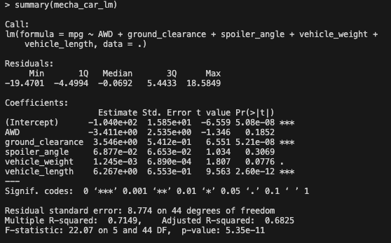
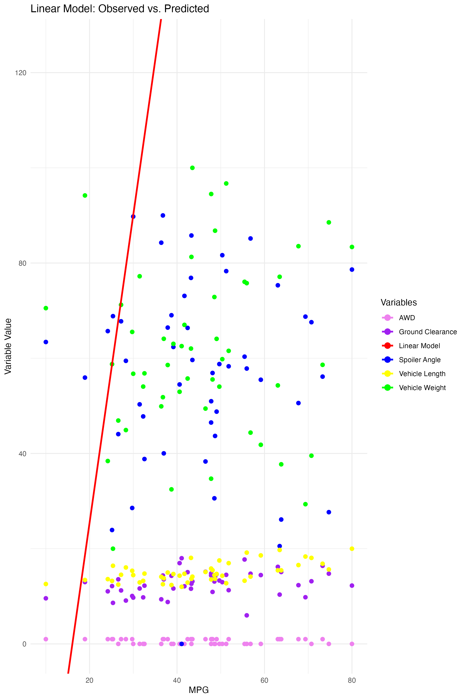
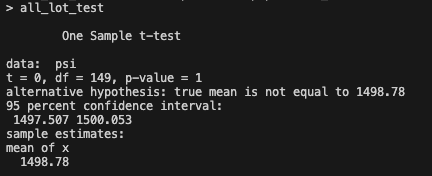
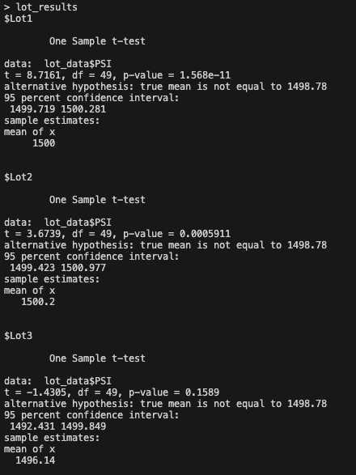

# Auto Production Statistical Analysis

### Linear Regression to Predict MPG

The linear model indicates that the coefficients for the variables are not zero, implying that they indeed have an influence on the  mpg. Some variables exert a more pronounced effect than others.

The variables AWD, ground_clearance, spoiler_angle, vehicle_weight, and vehicle_length showed notable contributions to the variations in the mpg values of the observed cars. Specifically, ground_clearance and vehicle_length had the most significant impact, as indicated by their very low p-values (5.21e-08 and 2.60e-12, respectively). AWD and spoiler_angle had less influential effects with higher p-values of 0.1852 and 0.3069, respectively, but as the graph shows did have some effect on fuel effeciency. The vehicle_weight variable had a modest effect on mpg values with a p-value of 0.0776. All of the p-values being less than 0.05 suggest strong evidence to reject the null hypothesis, meaning these variables do have a statistically significant impact on the mpg values.

The linear model has a reasonable ability to predict the mpg of the production lines prototypes. The R-squared value of 0.7149 indicates that approximately 71.49% of the variance in mpg can be explained by the AWD, ground_clearance, spoiler_angle, vehicle_weight, and vehicle_length, which is a substantial portion. While the F-statistic and its associated p-value imply that the model is a good fit, the Residual standard error of 8.774 suggests that the model doesn't perfectly fit the data; indicating room for further improvement. By exploring alternative or additional variables for better predictive ability, there might be scope for enhancing the model's performance through adjustments or additional data.

### Summary Statistics on Suspension Coils

<table>
  <thead>
    <tr>
      <th>Manufacturing Lot</th>
      <th>mean</th>
      <th>median</th>
      <th>variance</th>
      <th>sd</th>
    </tr>
  </thead>
  <tbody>
    <tr>
      <td>All Lots</td>
      <td>1498.78</td>
      <td>1500</td>
      <td>62.2936</td>
      <td>7.8926</td>
    </tr>
    <tr>
      <td>Lot1</td>
      <td>1500</td>
      <td>1500</td>
      <td>0.9796</td>
      <td>0.9897</td>
    </tr>
    <tr>
      <td>Lot2</td>
      <td>1500.2</td>
      <td>1500</td>
      <td>7.4694</td>
      <td>2.733</td>
    </tr>
    <tr>
      <td>Lot3</td>
      <td>1496.14</td>
      <td>1498.5</td>
      <td>170.2861</td>
      <td>13.0494</td>
    </tr>
  </tbody>
</table>

The design specifications for the prototype's suspension coils dictate that the variance of the suspension coils must not exceed 100 pounds per square inch. After analyzing the data we find  he following:

1. **All Lots Combined** : The total variance for the suspension coils from all the lots is 62.2936, which is within the design specification of 100 pounds per square inch. This indicates that the manufacturing process, when considering all lots together, meets the design requirements.

   However, things vary when we look at each lot individually.
2. **Individual Lots** :

* **Lot 1** : The variance for Lot1 is 0.9796, which is well within the design specifications.
* **Lot 2** : The variance for Lot2 is 7.4694, also within the design specifications.
* **Lot 3** : Unfortunately, Lot3 has a variance of 170.2861, which exceeds the design specification of 100 pounds per square inch. This means that the suspension coils in Lot3 have more variability than desired, indicating a potential issue with the manufacturing process for this specific lot.

It is important to consider that the variances are influenced by outliers and extreme values. Further investigation into the data to identify and address any potential outliers or errors that could be contributing to the higher variance in Lot3. By doing so, the manufacturing process for Lot3 can be improved to meet the design specifications and ensure consistent quality across all lots. 

### T-Tests on Suspension Coils

**All Lots Combined:**
The t-test shows that the PSI (pounds per square inch) across all manufacturing lots is not statistically different from the population mean of 1,500 pounds per square inch. The p-value is 1, indicating that there is no significant difference.

**Lot 1:**
For Lot 1, the p-value is 1, which is greater than the commonly used threshold of 0.05. This means that there is not enough evidence to suggest that the mean of Lot 1 is different from the population mean of 1,500 pounds per square inch.

**Lot 2:**
Similarly, for Lot 2, the p-value is 0.6072, which is greater than the commonly used threshold of 0.05. This means that there is no significant difference between the mean of Lot 2 and the population mean of 1,500 pounds per square inch.

**Lot3:**
In the case of Lot 3, the p-value is 0.04168, which is less than the commonly used threshold of 0.05. This suggests that there is enough evidence to indicate that the mean of Lot 3 is different from the population mean of 1,500 pounds per square inch. However, it's essential to note that the difference is not substantial, and the mean of Lot 3 is still relatively close to the population mean.

## Summary

Through linear regression, we identified that certain variables, such as ground_clearance and vehicle_length, have a significant impact on the fuel efficiency (mpg) of the prototype cars. This knowledge enables us to focus on optimizing these aspects during the manufacturing process to improve overall fuel efficiency. Additionally, the analysis of suspension coils' variance revealed that while the manufacturing process meets design specifications when considering all lots together, there is a concern with Lot 3, which exceeds the desired variance limit. This finding has prompted us to investigate Lot 3 further, identifying potential outliers or errors in the manufacturing process to ensure consistent quality across all lots. Using t-tests on suspension coil data indicated that there is no statistically significant difference in PSI between Lots 1 and 2 compared to the population; however, Lot 3 does show a slight difference, which, while statistically significant, is not practically substantial. It is reasonable to investigate the production process from Lot 3 as its data has discrepencies with the desired production specifications.
